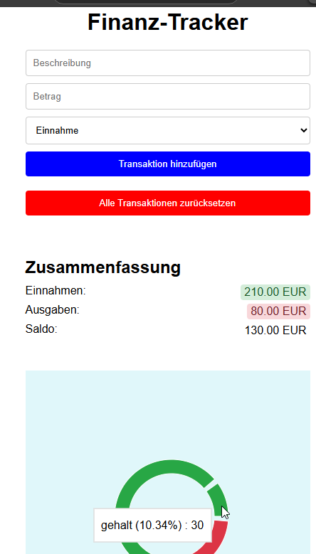

# Finanz-Tracker

Dies ist eine einfache Finanz-Tracker-Anwendung, die es Benutzern ermöglicht, ihre Einnahmen und Ausgaben zu verfolgen. Die Anwendung bietet eine Übersicht über die Gesamteinnahmen, Gesamtausgaben und den aktuellen Saldo. Außerdem werden die Prozentsätze der Einnahmen und Ausgaben angezeigt.
https://diego-monfort-landolt.github.io/finance-app/

## Funktionen

- Hinzufügen von Transaktionen mit Beschreibung, Betrag und Typ (Einnahme oder Ausgabe)
- Löschen von Transaktionen
- Zurücksetzen aller Transaktionen
- Anzeige der Gesamteinnahmen, Gesamtausgaben und des aktuellen Saldos
- Anzeige der Prozentsätze der Einnahmen und Ausgaben

## Installation

1. Klone das Repository:
   ```bash
   git clone https://github.com/diego-monfort-landolt/finance.git

   cd finanz-tracker
   npm install
   npm start


Hauptkomponenten
App.tsx: Die Hauptkomponente der Anwendung, die die Benutzeroberfläche und die Logik für das Hinzufügen, Löschen und Zurücksetzen von Transaktionen enthält.

Wichtige Funktionen
addTransaction: Fügt eine neue Transaktion hinzu.
deleteTransaction: Löscht eine vorhandene Transaktion.
resetTransactions: Setzt alle Transaktionen zurück.

Berechnung der Gesamteinnahmen, Gesamtausgaben und des aktuellen Saldos.
Berechnung der Prozentsätze der Einnahmen und Ausgaben.

Mitwirken
Beiträge sind willkommen!

Bitte erstelle einen Pull-Request oder eröffne ein Issue, um Fehler zu melden oder neue Funktionen vorzuschlagen.


